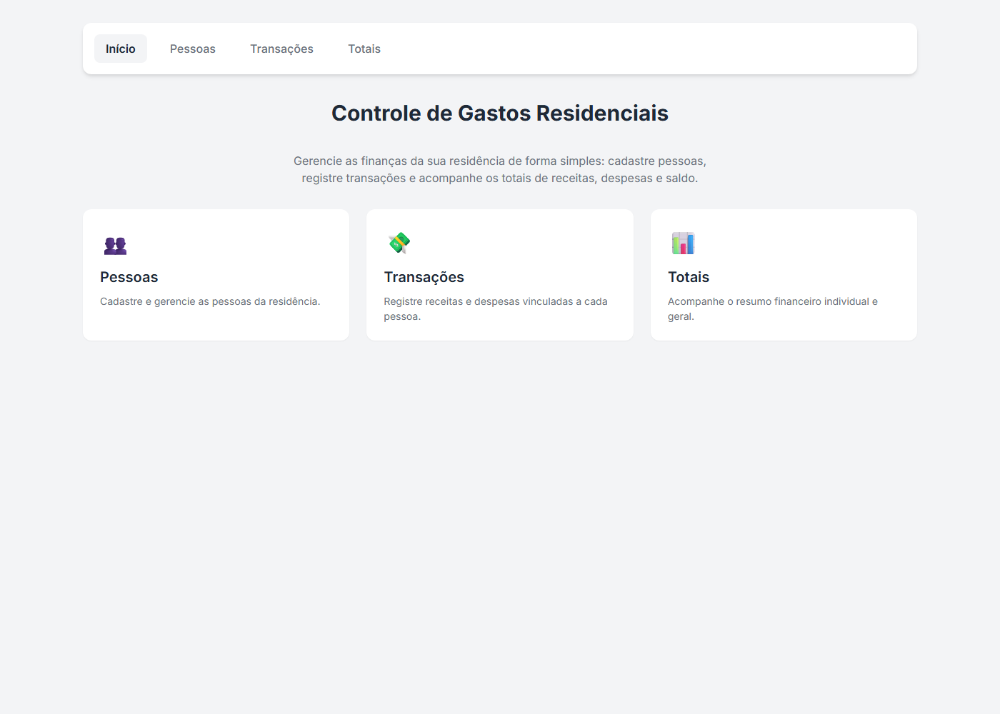
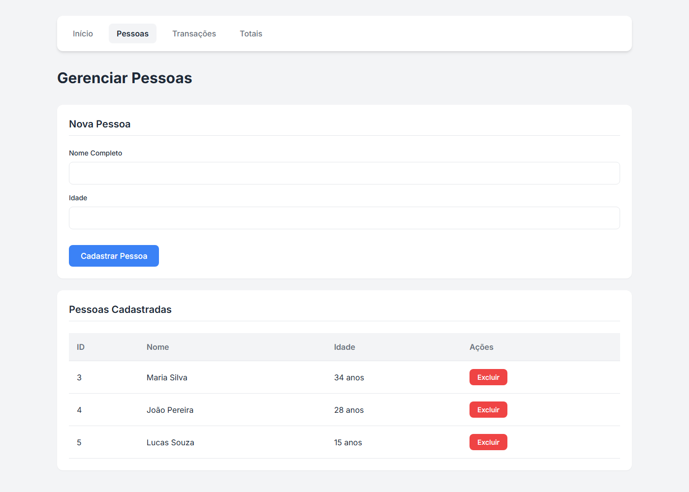
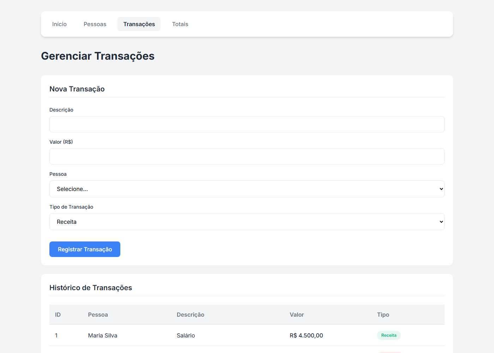
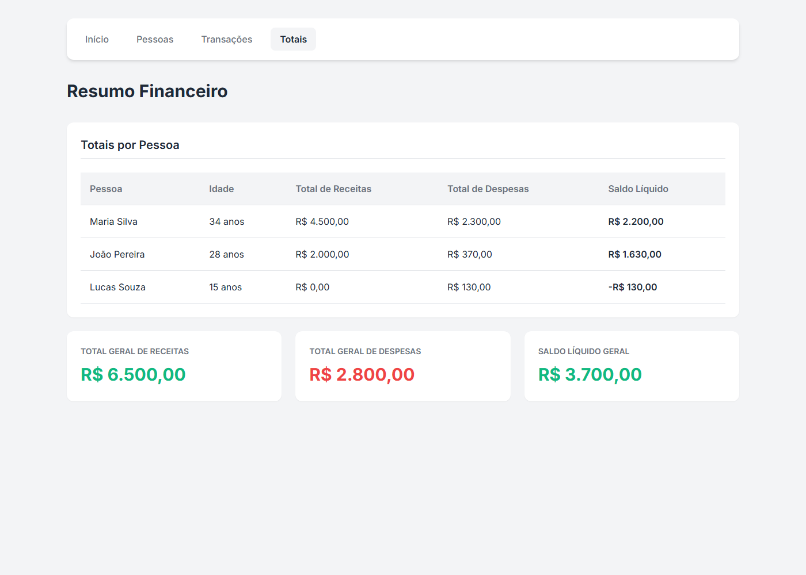

# Controle de Gastos Residenciais

Sistema full-stack para gerenciamento de gastos residenciais, desenvolvido como desafio técnico para vaga de estágio em TI (Desenvolvimento).

A aplicação permite cadastrar pessoas, registrar transações financeiras (receitas e despesas) e consultar totais individuais e gerais. Os dados persistem em banco SQLite e permanecem disponíveis após fechar a aplicação.

## Telas

### Página inicial


### Cadastro de pessoas


### Cadastro de transações


### Consulta de totais


## Tecnologias

| Camada | Stack |
|--------|-------|
| Back-end | .NET 8, ASP.NET Core Web API, Entity Framework Core, SQLite |
| Front-end | React 19, TypeScript, Vite, React Router, React Hook Form, Zod |
| Testes | xUnit, Moq |
| Infra | Docker e Docker Compose |

## Funcionalidades implementadas

### Cadastro de pessoas
- Criação, listagem e exclusão
- Campos: `id` (auto-incremento), `nome`, `idade`
- Ao excluir uma pessoa, todas as transações vinculadas são removidas automaticamente (cascade delete no EF Core)

### Cadastro de transações
- Criação e listagem
- Campos: `id` (auto-incremento), `descricao`, `valor`, `tipo` (receita/despesa), `pessoaId`
- A pessoa referenciada deve existir no cadastro
- **Regra de negócio:** menores de 18 anos só podem registrar **despesas** (validado no back-end e refletido no front-end)

### Consulta de totais
- Lista todas as pessoas com total de receitas, despesas e saldo individual
- Ao final, exibe os totais gerais (receitas, despesas e saldo líquido)

## Arquitetura

```
controle-gastos/
├── ControleGastos.Api/       # API REST (.NET 8)
│   ├── Controllers/          # Endpoints HTTP
│   ├── Services/             # Regras de negócio
│   ├── Repositories/         # Acesso a dados (EF Core)
│   ├── Models/               # Entidades de domínio
│   ├── DTOs/                 # Contratos de entrada/saída
│   ├── Data/                 # DbContext
│   └── Middlewares/          # Tratamento global de erros
├── ControleGastos.Tests/     # Testes unitários
└── frontend/                 # SPA React + TypeScript
```

### Decisões técnicas

- **Camada de serviço:** concentra as regras de negócio (validação de idade, existência de pessoa, cálculo de totais)
- **Middleware global de exceções:** respostas padronizadas para erros de validação (400), não encontrado (404) e erro interno (500)
- **Migrations do EF Core:** evolução controlada do esquema do banco (substitui `EnsureCreated()`)
- **SQLite:** atende ao requisito de persistência local sem necessidade de servidor de banco externo
- **Testes unitários:** cobrem a regra de menores de idade e o cálculo de totais

## Como executar

### Pré-requisitos

- [.NET 8 SDK](https://dotnet.microsoft.com/download)
- [Node.js 18+](https://nodejs.org/)
- [Docker Desktop](https://www.docker.com/) *(opcional)*

### Opção 1 — Docker (recomendado)

Na pasta `controle-gastos`:

```bash
docker-compose up --build
```

| Serviço | URL |
|---------|-----|
| Front-end | http://localhost:5173 |
| API | http://localhost:5000 |
| Swagger | http://localhost:5000/swagger |

### Opção 2 — Execução manual

**1. Back-end**

```bash
cd controle-gastos/ControleGastos.Api
dotnet run
```

A API sobe em `http://localhost:5000`. O banco `gastos.db` é criado automaticamente via migrations ao iniciar.

**2. Front-end** *(em outro terminal)*

```bash
cd controle-gastos/frontend
npm install
npm run dev
```

Acesse `http://localhost:5173`.

> Para apontar o front-end a outra URL da API, crie `frontend/.env` com:
> `VITE_API_URL=http://localhost:5000/api`

## Testes

```bash
cd controle-gastos
dotnet test
```

Cenários cobertos:
- Pessoa inexistente ao criar transação → `NotFoundException`
- Menor de idade tentando criar receita → `BusinessRuleException`
- Maior de idade criando receita → sucesso
- Menor de idade criando despesa → sucesso
- Cálculo de totais por pessoa e totais gerais

## Endpoints da API

| Método | Rota | Descrição |
|--------|------|-----------|
| `GET` | `/api/pessoas` | Lista todas as pessoas |
| `GET` | `/api/pessoas/{id}` | Busca pessoa por ID |
| `POST` | `/api/pessoas` | Cadastra nova pessoa |
| `DELETE` | `/api/pessoas/{id}` | Exclui pessoa e transações vinculadas |
| `GET` | `/api/transacoes` | Lista todas as transações |
| `POST` | `/api/transacoes` | Cadastra nova transação |
| `GET` | `/api/transacoes/totais` | Retorna totais por pessoa e gerais |

## Autor

**Tauan El Silva**

Repositório público: https://github.com/Tauanelsilva/Desafio-tecnino--controle-de-gastos
